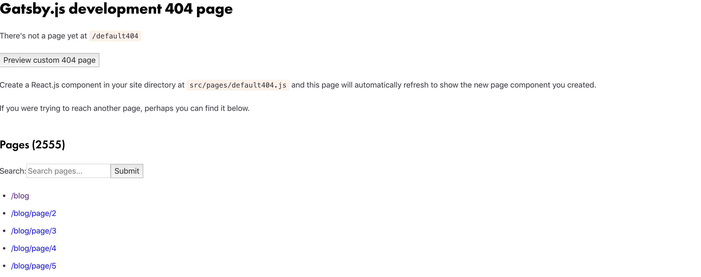
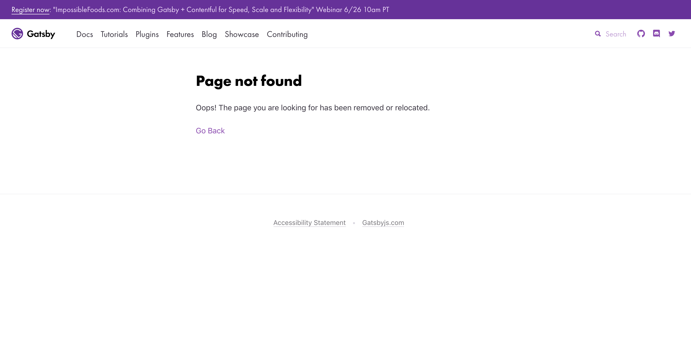

To create a 404 page create a page whose path matches the regex
`/404*`. Most often you'll want to create a React component page at
`src/pages/404.js`.

Gatsby ensures that your 404 page is built as `404.html` as many static hosting
platforms default to using this as your 404 error page. If you're hosting your
site another way, you'll need to set up a custom rule to serve this file for 404
errors.

Because Gatsby creates this page for you by default, there is no need to configure
it in your `gatsby-node.js` file.

When developing using `gatsby develop`, Gatsby uses a default 404 page that
overrides your custom 404 page. However, you can still preview your 404 page by
clicking "Preview custom 404 page" to verify that it's working as expected. This is
useful when you're developing so that you can see all the available pages.

The screenshot below shows the default 404 page that Gatsby creates.
It also lists out all the pages on your website. Clicking the "Preview custom 404
page" button will allow you to view the 404 page you created.

The screenshot below shows the custom 404 page.

